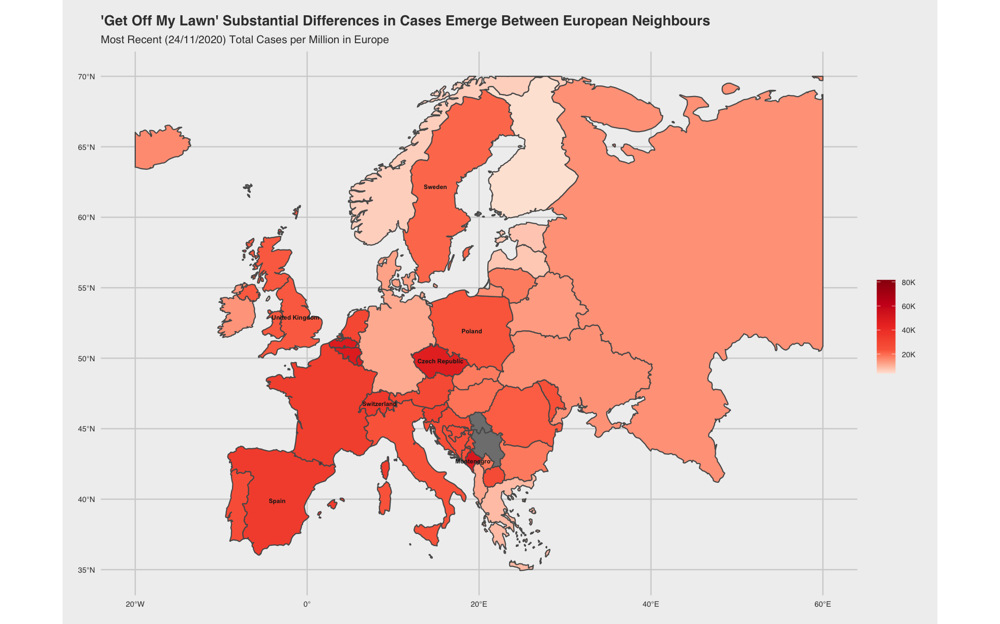
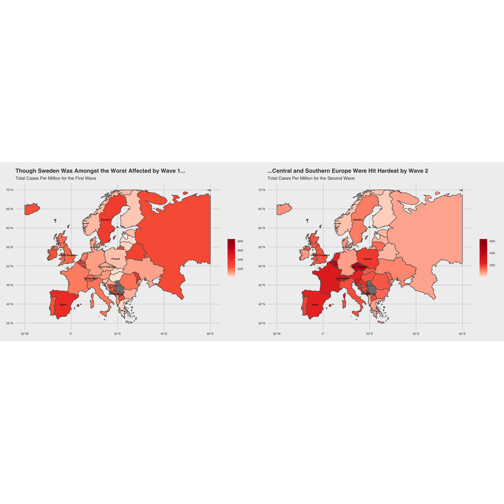
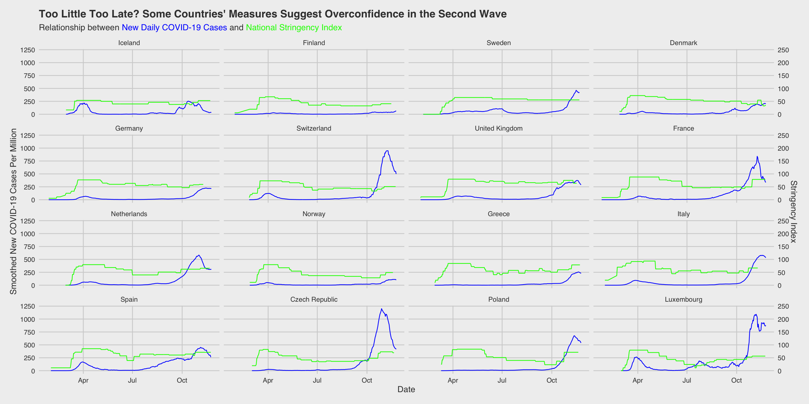
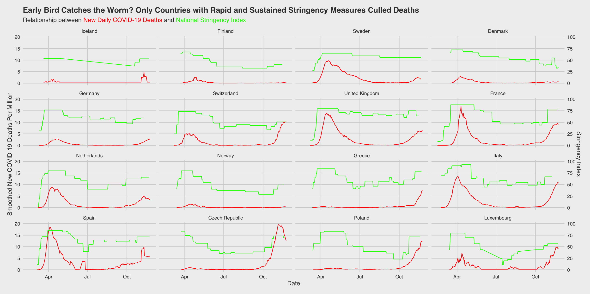
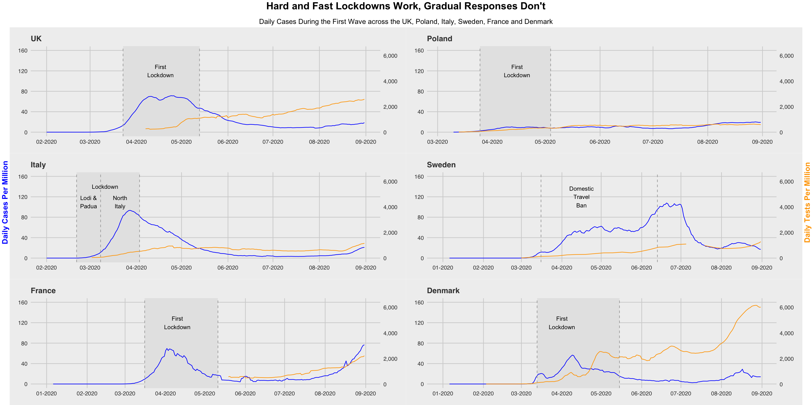
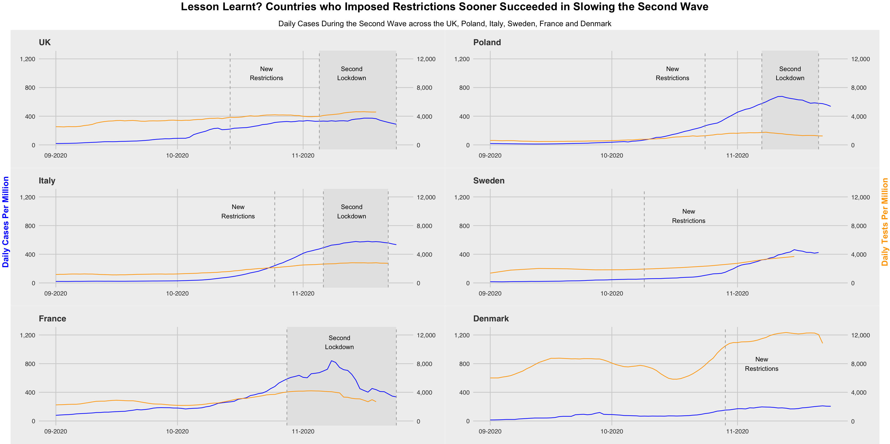
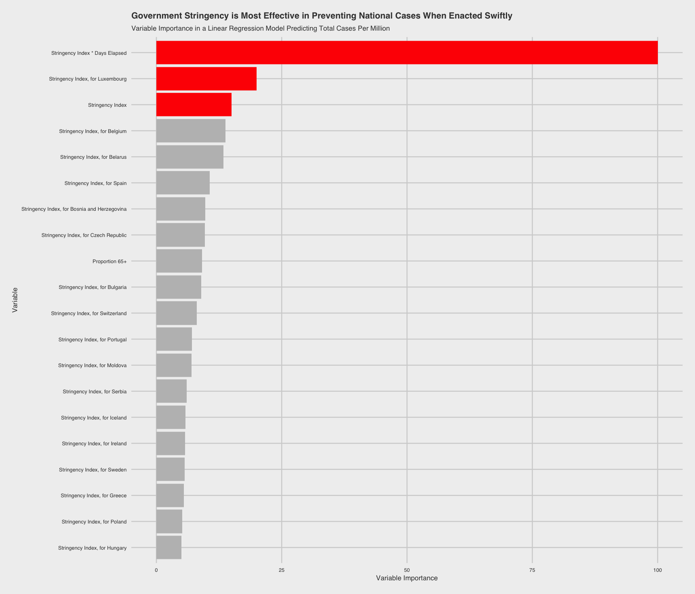

# **"No Need to Panic, It's All Under Control..."**  

## **A Visual Critique of European Government's COVID-19 Response Strategiess**

**Note:** *this was a group project conducted in a team of three. My responsibility was to produce all visualisations and analyses following data cleaning and exploration (Plots 3-6), and to project manage timely, high-quality output. I also set the overarching research questions and authored our final analyses and reflections.*

---

# Executive Summary  

See [this Presentation Deck](https://drive.google.com/file/d/1dHAeGL2m-qiW2Y1bPKTi72TfIusdoo0o/view?usp=sharing "A Visual Critique of European Government's COVID-19 Response Strategies") for a full report of this project, including a summary of the research process, key results and a brief project evaluation. 

# The Problem 
 
The global COVID-19 pandemic has defined the past year. With 63.3m cases causing 1.47m deaths worldwide, governments have fought relentlessly to contain the spread of the virus and reduce fatalities. While some have enforced stringent lockdowns for prolonged periods with high levels of social compliance, others have taken relaxed approaches in an effort to minimise the economic fallout. Since Europe represents a dense cluster of loosely affiliated, highly developed countries each governed autonomously, it is an optimal case study for understanding the role of policy in controlling the outbreak and minimising casualties. Guided by visual analysis, in this project we seek to identify patterns in the mitigation strategies of European governments, and ultimately identify best practices. 

See my [interactive Tableau Dashboard](https://public.tableau.com/profile/alberto7149#!/vizhome/COVID-19Dashboard_16070923853150/COVID-19Dashboard "Investigating the Spread of COVID-19") to glean a better understanding of the spread and severity of the COVID-19 pandemic over time. 

This study asks the exploratory question "What have European governments done to mitigate the spread of COVID-19?", before asking the more pressing follow-up: "How successful have these measures been at limiting cases and fatalities, and what be learned from both the greatest successes and failures?". Employing a breadth of visual and statistical techniques, including spatial mapping, time-series analysis, and linear regression, we compare the success of European governments in containing the fall-out from the global COVID-19 pandemic.  

**Specifically, we provide answers to the questions:**   

**i.      WHERE have COVID-19 response strategies been successful?;**  

**ii.	    WHAT mitigation strategies have been most effective at combatting the virus?;**

**iii.	  WHICH factors are most important in determining the success of mitigation strategies and;**   

**iv.     HOW does the theorised efficacy of mitigation strategies vary between countries?**     

# The Data

**We employ 3 datasets in for analysis, each of which are cleaned individually, before being combined into a single data frame filtered only to European cases, covid_europe**

main dataset -> owid-covid-data   
https://covid.ourworldindata.org/data/owid-covid-data.csv

hospital data -> data  
https://www.ecdc.europa.eu/en/publications-data/download-data-hospital-and-icu-admission-rates-and-current-occupancy-covid-19

testing data -> covid-testing-all-observations  
https://github.com/owid/covid-19-data/blob/master/public/data/testing/covid-testing-all-observations.csv

# The Solution

These analyses drive the conclusion that, though the efficacy of certain measures is highly country-specific, **stringent**, **stable** and **rapidly enacted (fast)** measures clearly predict how well national governments handled the crisis. Specifically, we find that the **timing** of government responses relative to the first nationwide outbreak (the first reported case) is the most important factor in determining their success in keeping cases down. This provides valuable lessons for governments as they battle the second and third waves of the pandemic and seek to overcome pandemics in future. 

# **Analysis in R**

---

### OBJECTIVE 1 (Plots 1 and 2)  
**Visualise the Current State of the COVID-19 Pandemic in Europe**  

*Outcomes:*                     Two Spatial Maps, Demonstrating Current Normalised Cases and Deaths Across Europe.    

*Insights:*                     An understanding of how different European regions have experienced the crisis differently, allowing selection of key cases.    

### OBJECTIVE 2 (Plots 3 and 4)
**Compare How Key European Countries Have Experienced the Pandemic in Terms of Cases and Deaths, and the Measures they Have Taken**   

*Outcomes:*                     Time Series Analyses Illustrating the Relationship between Stringency of Government Measures and subsequent cases/deaths.   

*Insights:*                     Identification of countries where response strategies were and were not *i) successful*, and selection of interesting cases.  

### OBJECTIVE 3 (Plot 5)  
**Deep-Dive into Specific, Characteristically Distinct Government Responses to the Pandemic, selected using plots 3 and 4**     

*Outcomes:*                     Time Series Analyses Illustrating the Relationship between Cases, Tests, and Government Measures for Selected Cases from Plot 3.    

*Insights:*                     Deeper understanding of the type of policies underlying the stringency index, and their relative *ii) efficacy* and timing.    

### OBJECTIVE 4 (Plot 6) 
**Empirically ratify hypothesised relationships between certain factors and COVID-19 cases drawn from Plots 1-5,rank these factors by importance, and evaluate country-level heterogeneity**  

*Outcomes:*                     Ordinary Least Squares (OLS) Linear Regression Model Which Provides Both Factor Coefficient Estimates and Ranks Factor Importance.    

*Insights:*                     Empirical relationships between government stringency (response) and outcomes, demonstrating: *iii) which factors are most important in determining success of mitigation strategies* and *iv) how the efficacy of mitigation strategies vary between countries*.  

```{r, setup, include=FALSE} 
knitr::opts_chunk$set(
  message = FALSE, 
  warning = FALSE, 
  tidy=FALSE,     # display code as typed
  size="small")   # slightly smaller font for code
options(digits = 3)

# default figure size
knitr::opts_chunk$set(
  fig.width=8, 
  fig.height=5,
  fig.align = "left"
)

#all chunks are shown, but not run: only the figures outputted are shown to reduce computational burden
knitr::opts_chunk$set(eval = FALSE,cache=FALSE)

```

```{r, load_libraries, include = FALSE}
library(readr) #load dataset
library(tidyverse)
library(lubridate)
library(janitor)
library(skimr)
library(sf)
library(ggmap)
library(ggrepel)
library(gridExtra)
library(pander)
library(here)
library(leaflet)
library(tmap)
library(tmaptools)
library(hrbrthemes)
library(patchwork)
library(kableExtra)
library(scales)
library(here)
library(janitor)
library(broom)
library(tidyquant)
library(infer)
library(openintro)
library(knitr)
library(patchwork)
library(scales)
library(tidytext)
library(plotly)
library(corrplot)
library(leaflet)
library(rsample) 
library(ggfortify)
library(car)
library(huxtable)
library(Hmisc) #describe function
library(here)
library(vroom)
library(ggthemes)
library(cluster)
library(ggtext)
library(caret)
library(ggpubr)
library(ggplot2)
library(sf)
library(rnaturalearth)

```

# Load Data

```{r loading_data}
#loading first data set, incl. GDP
owid_covid_data <- read_csv(here::here('data','owid-covid-data.csv'))
#cleaning the names
covid_data <- owid_covid_data %>% 
  clean_names()

#loading second data set: testing data
covid_testing_all_observations <- read_csv(here::here('data','covid-testing-all-observations.csv'))
#cleaning the names
covid_testing<- covid_testing_all_observations %>% 
  clean_names()

#loading third data set: number of hospitalized patients
hospital_data_original <- vroom(here::here('data','data.csv'))
#cleaning the names
hospital_data <- hospital_data_original %>% 
  clean_names()

```

# Clean data

## Dataset 1: owid-covid-data

We start with the `covid_data`, which has 48 covid-related indicators of a country in a given date. From the `skim` below, we observe:

* 17 completely empty columns 
* Incompleteness in almost all columns

```{r dataset1 skim, message=FALSE,results='hide',warning=FALSE}
skim(covid_data)
```

```{r dataset1 remove duplicates and empties,message=FALSE,results='hide',warning=FALSE}
#check for duplicates
covid_data %>% get_dupes(date, iso_code) # no duplicates 
#Remove empty columns and rows
covid_data_clean <- remove_empty(covid_data, which = c("rows","cols")) # 17 columns and 0 rows removed
```

We start to clean each columns. We can see there are some rows with `location = International`which makes our `iso_code` NA. Since our analysis mainly focus on each countries, we will delete these rows. For the `continent` variable, we found that its NA come from`location = 'World'`, which is actually derivable from other rows, thus we will delete them.

```{r dataset1 clean iso_code and continent,message=FALSE,results='hide',warning=FALSE}
# NAs in iso_code
head(covid_data_clean[is.na(covid_data$iso_code),])
# delete them
covid_data_clean <- 
  covid_data_clean %>% filter(!is.na(iso_code))
# NAs in continent
head(covid_data_clean[is.na(covid_data_clean$continent),])
covid_data_clean <- covid_data_clean %>% 
  filter(!is.na(continent))
```

For the `gdp_per_capita` column, there are 28 countries/territories with missing values. And they are missing across all the days. We impute some of them, with data from world bank if it is availble, and leave the rest in NAs

```{r dataset1 clean gdp_per_capita,message=FALSE,results='hide',warning=FALSE}
# check if the gdp_per_capita of countries are NA all the time 
covid_data_clean %>% 
  filter(is.na(gdp_per_capita)) %>% 
  group_by(location) %>% 
  summarise(all_na = all(is.na(gdp_per_capita)))

covid_data_clean[covid_data_clean$location =='Andorra','gdp_per_capita'] = 45887
covid_data_clean[covid_data_clean$location =='Cuba','gdp_per_capita'] = 6816
covid_data_clean[covid_data_clean$location =='Faeroe Islands','gdp_per_capita'] = 48530
covid_data_clean[covid_data_clean$location =='Greenland','gdp_per_capita'] = 49311
covid_data_clean[covid_data_clean$location =='Guam','gdp_per_capita'] = 31477
covid_data_clean[covid_data_clean$location =='Isle of Man','gdp_per_capita'] = 90190
covid_data_clean[covid_data_clean$location =='Liechtenstein','gdp_per_capita'] = 141200
covid_data_clean[covid_data_clean$location =='Monaco','gdp_per_capita'] = 196061
covid_data_clean[covid_data_clean$location =='Northern Mariana Islands','gdp_per_capita'] = 18577
covid_data_clean[covid_data_clean$location =='Turks and Caicos Islands','gdp_per_capita'] = 21028
covid_data_clean[covid_data_clean$location =='United States Virgin Islands','gdp_per_capita'] = 11069

skim(covid_data_clean)
```
##  Dataset 2: Hospital Data

```{r dataset2 skim,message=FALSE,results='hide',warning=FALSE}
skim(hospital_data)
```

We remove all rows with no indicator as we don't know what it would stand for in cases where `indicator` = NA, similarly we remove rows with NA in `value`

```{r dataset2 clean indicator and value,message=FALSE,results='hide',warning=FALSE}
hospital_data_clean <- hospital_data %>%
  filter(!is.na(indicator))
hospital_data_clean <- hospital_data_clean %>%
  filter(!is.na(value))
```

We then deselect some columns and pivot hospital data to a clean format

```{r clean data format,message=FALSE,results='hide',warning=FALSE}

hospital_data_clean <- hospital_data_clean %>% 
  pivot_wider(names_from=indicator, values_from=value) %>% 
  select(c(1,2,6,7)) %>% 
  clean_names() %>% 
  group_by(date, country) %>% 
  summarise(daily_hospital_occupancy = sum(daily_hospital_occupancy),
            daily_icu_occupancy = sum(daily_icu_occupancy))

hospital_data_clean %>% get_dupes(date, country) # no duplicates

```

## Dataset 3: COVID Testing Dataset

We explore the dataset...

```{r explore testing,message=FALSE,results='hide',warning=FALSE}
skim(covid_testing)

# we can drop a few variables such as source_url, source_label and note

covid_testing_process <- covid_testing %>% 
  select(-c(source_url, source_label, notes))
         
skim(covid_testing_process)

#show a couple of entries for specific country

covid_testing_process %>% 
  filter(iso_code == "POL") %>% 
  arrange(desc(date)) %>% 
  head(5)

```
As we can observe there are two metrics: people tested and samples tested. Having browsed the source of the dataset we are not able to conclude which data is correct, thus we are going to take daily average for specific dates.   

```{r clean testing,message=FALSE,results='hide',warning=FALSE}

#average daily data per country and omit na's

covid_testing_process1 <-covid_testing_process %>% 
  dplyr::group_by(date, iso_code) %>% 
  dplyr::summarise(cumulative_tests = mean(cumulative_total, na.rm = TRUE),
            daily_tests = mean(daily_change_in_cumulative_total, na.rm = TRUE),
            cumulative_tests_per_thousand = mean(cumulative_total_per_thousand, na.rm = TRUE),
            x7_day_daily_test_change = mean(x7_day_smoothed_daily_change, na.rm = TRUE),
            x7_day_daily_test_change_per_thousand = mean(x7_day_smoothed_daily_change_per_thousand, na.rm = TRUE),
            short_term_tests_per_case = mean(short_term_tests_per_case, na.rm = TRUE),
            short_term_positive_rate = mean(short_term_positive_rate, na.rm = TRUE))

#check the results

covid_testing_process1 %>% 
  filter(iso_code == "USA") %>% 
  arrange(desc(date)) %>% 
  head(5)

```

## Merging the 3 Datasets into 1

```{r merge dataset,message=FALSE,results='hide',warning=FALSE}

#rename columns in hospital dataset in order to join datasets

hospital_data_clean <- hospital_data_clean %>% 
  rename(location = country)

#merging datasets

covid_total <- covid_data_clean %>% 
  left_join(hospital_data_clean, by= c("location", "date")) %>% 
  left_join(covid_testing_process1, by = c("date", "iso_code"))

#see what's inside

skim(covid_total)

```

We observe that there are still quite a few missing values, however we are going to focus on Europe in our analysis.

```{r select europe,message=FALSE,results='hide',warning=FALSE}
#filter for European countries

unique(covid_total$continent)

covid_europe <- covid_total %>% 
  filter(continent == "Europe") %>% 
  clean_names()

skim(covid_europe)
```
## Enriching dataset

We are going to enrich the dataset by defining the following variables:  

- day0_cases -> date when daily cases first hit 1000  
- day0_deaths -> date when daily deaths first hit 100  
- day0_cases_elapsed -> days elapsed from day_0_cases  
- day0_deaths_elapsed -> days elapsed from day_0_deaths  
- day0_difference -> days elapsed between daily cases first hit 1000 and daily deaths 100

```{r enriching the dataset,message=FALSE,results='hide',warning=FALSE}

##days elapsed since daily cases exceeded 1000 for the first time

#find the date zero
calc_day0 <- covid_europe %>% 
  filter(new_cases >= 1000) %>% 
  group_by(location) %>% 
  summarise(day0_cases = min(date))

#merge data with zero date
covid_europe_process <- covid_europe %>% 
  left_join(calc_day0, by = "location") %>% 

#add metric counting days from day 0

  mutate(day0_cases_elapsed = as.numeric(date - day0_cases)) %>% 
  
  #assign NA for negative days
  mutate(day0_cases_elapsed = case_when(
    day0_cases_elapsed < 0 ~ NA_real_,
    TRUE ~ day0_cases_elapsed
  ))

##days elapsed since daily deaths exceeded 100 for the first time

#find the date zero
calc_day0 <- covid_europe %>% 
  filter(new_deaths >= 100) %>% 
  group_by(location) %>% 
  summarise(day0_deaths = min(date))

#merge data with zero date
covid_europe_process2 <- covid_europe_process %>% 
  left_join(calc_day0, by = "location") %>% 

#add metric counting days from day 0

  mutate(day0_deaths_elapsed = as.numeric(date - day0_deaths)) %>% 
  
  #assign NA for negative days
  mutate(day0_deaths_elapsed = case_when(
    day0_deaths_elapsed < 0 ~ NA_real_,
    TRUE ~ day0_deaths_elapsed
  ))

##days elapsed between daily cases hit 1000 and daily deaths hit 100

#use threshold for daily deaths (some countries exceeded 1000 daily cases, but not 100 dail deaths)

calc_day0 <- covid_europe_process2 %>% 
  filter(new_deaths >= 100) %>% 
  group_by(location) %>% 
  summarise(day0_difference = min(as.numeric(day0_deaths - day0_cases))) #use min in order to get only 1 result per country

#merge all data

covid_europe_process3 <- covid_europe_process2 %>% 
  left_join(calc_day0, by = "location")

covid_europe <- covid_europe_process3

#clean temporary objects

rm(calc_day0,covid_europe_process, covid_europe_process2, covid_europe_process3)
```

Adjustments made in the following two plots:

1. We changed the date to most recent instead of Nov 24 2020 to avoid NAs, because some countries may not have yet reported their cases in that day
2. We changed the color scale, using  https://gka.github.io/palettes/#/9|s|ffffe0,920000|ffffe0,ff005e,93003a|1|1
3. We added some country names on the map. If we show all of them that would be too busy. We can adjust the names of the countries we want to show by changing the `country_list`

#Building Visualisations to Tell Our Story

We begin by setting the scene of the 'state of COVID=19' in Europe, before exploring the relationship between government measures and deaths/cases, and delving into 6 distinct country case studies to understand how specific public policy decisions have translated into COVID-19 outcomes. Finally, we build a predictive model using OLS Regression.

## Plot 1 - Map of COVID-19 Cases Across Europe

**Designed to demonstrate the current state of the COVID-19 Pandemic in Europe and inform further avenues of inquiry**

```{r top 5 sum new_cases countries,message=FALSE,results='hide',warning=FALSE}
top_5_country <- covid_europe %>% 
  group_by(location) %>% 
  summarise(sum = sum(new_cases_per_million)) %>% 
  arrange(desc(sum)) %>% 
  top_n(5) %>% 
  select(location) %>% 
  pull()
# Top 5 countries with most cases are France, Russia, Spain, United Kingdom and Italy
```

```{r mapping,message=FALSE,results='hide',warning=FALSE}

# combine map with covid european data at the most recent date
covid_europe_lateset <- covid_europe %>% 
  group_by(location) %>% 
  mutate(my_rank = order(date, decreasing = TRUE)) %>% 
  filter(my_rank == 1)

top_5_country_latest <- covid_europe_lateset %>% 
  group_by(location) %>% 
  summarise(sum = sum(new_cases_per_million)) %>% 
  arrange(desc(sum)) %>% 
  top_n(5) %>% 
  select(location) %>% 
  pull()

top_5_country_latest <- c('Switzerland','San Marino','Luxembourg','Montenegro')

scale1 <- c('#feedde','#fdd0a2','#fdae6b','#fd8d3c','#f16913','#d94801','#8c2d04')
scale2 <- c('#fee5d9','#fcbba1','#fc9272','#fb6a4a','#ef3b2c','#cb181d','#99000d')
scale3 <- c('#fee5d9','#fb6a4a','#ef3b2c','#cb181d','#99000d')
scale4 <- c('#fee5d9','#ef3b2c','#cb181d','#99000d')

country_list_lastest = c(top_5_country_latest,'Poland','Sweden', 'England')
country_list = c(top_5_country,'Poland','Sweden', 'England')
# get the world map
worldmap <- ne_countries(scale = 'medium', type = 'map_units', continent = 'europe',
                         returnclass = 'sf')
# get the euro map
europe_cropped <- st_crop(worldmap, xmin = -20, xmax = 60,
                                    ymin = 30, ymax = 70)


euro_joined <- left_join(europe_cropped, covid_europe_lateset, by = c("admin" = "location"))


# mapping the covid data
map_total <- euro_joined %>% 
  ggplot() +
  geom_sf(aes(fill = total_cases_per_million)) +
  geom_sf_text(data = euro_joined[euro_joined$subunit %in% country_list,], aes(label = admin), size = 2, fontface = "bold",color = 'grey10') +
  labs(title = "'Get Off My Lawn' Substantial Differences in Cases Emerge Between European Neighbours",subtitle = "Most Recent (24/11/2020) Total Cases per Million in Europe", x='',y=''
       # caption = 'Source:https://owid.data'
       ) +
  scale_fill_gradientn(name = NULL,colours = scale3,labels = c(0,'20K','40K','60K','80K')) +
  theme_fivethirtyeight() + 
  theme(legend.position = 'right', legend.direction = 'vertical') +
  theme(plot.title = element_text(size = 13, face = "bold"), 
        plot.subtitle = element_text(size = 10), 
        # plot.caption = element_text(size = 5),
        axis.text = element_text(size = 7),
        legend.text = element_text(size = 7))

map_total


```

```{r plot01, eval=TRUE, include=FALSE, fig.show=TRUE}



```
  
  
## Plot 2 - Map of COVID-19 Cases Across Europe, by Wave

**Designed to Demonstrate how the First and Second Waves Hit Different Countries Differently - to Inform Our Case-Study Selection**

``` {r lockdown_maps,message=FALSE,results='hide',warning=FALSE}

# combine map with covid european data at the most recent date
covid_europe_lateset1 <- covid_europe %>% 
  filter(date == "2020-09-01") %>%
    group_by(location) 

covid_europe_lateset2 <- covid_europe %>% 
  filter(date == "2020-11-20") %>%
    group_by(location) 

covid_europe_lateset3 <- left_join(covid_europe_lateset2, covid_europe_lateset1, by = c("location" = "location"))

# Calculating the cases between September and 20November
covid_europe_lateset3$total_cases_lockdow2_per_mil <- covid_europe_lateset3$total_cases_per_million.x-covid_europe_lateset3$total_cases_per_million.y


#joining maps with cases in lockdown2
euro_joined1 <- left_join(europe_cropped, covid_europe_lateset1, by = c("admin" = "location"))
euro_joined2 <- left_join(europe_cropped, covid_europe_lateset3, by = c("admin" = "location"))


par(mfrow=c(1,2))

#Lockdown 1
# mapping the covid data
map_total_lockdown1 <- euro_joined1 %>% 
  ggplot() +
  geom_sf(aes(fill = total_cases_per_million)) +
  geom_sf_text(data = euro_joined1[euro_joined1$subunit %in% country_list,], aes(label = admin), size = 2, fontface = "bold",color = 'grey10') +
  labs(title = 'Though Sweden Was Amongst the Worst Affected by Wave 1...',subtitle = "Total Cases Per Million for the First Wave", x='',y=''
       # caption = 'Source:https://owid.data'
       ) +
  scale_fill_gradientn(name = NULL,colours = scale3,labels = c(0,'20K','40K','60K','80K')) +
  theme_fivethirtyeight() + 
  theme(legend.position = 'right', legend.direction = 'vertical') +
  theme(plot.title = element_text(size = 13, face = "bold"), 
        plot.subtitle = element_text(size = 10), 
        # plot.caption = element_text(size = 5),
        axis.text = element_text(size = 7),
        legend.text = element_text(size = 7))

#Lockdown2
# mapping the covid data
map_total_lockdown2 <- euro_joined2 %>% 
  ggplot() +
  geom_sf(aes(fill = total_cases_lockdow2_per_mil)) +
  geom_sf_text(data = euro_joined2[euro_joined2$subunit %in% country_list,], aes(label = admin), size = 2, fontface = "bold",color = 'grey10') +
  labs(title = '...Central and Southern Europe Were Hit Hardest by Wave 2',subtitle = "Total Cases Per Million for the Second Wave", x='',y=''
       # caption = 'Source:https://owid.data'
       ) +
  scale_fill_gradientn(name = NULL,colours = scale4,labels = c(0,'20K','40K','60K')) +
  theme_fivethirtyeight() + 
  theme(legend.position = 'right', legend.direction = 'vertical') +
  theme(plot.title = element_text(size = 13, face = "bold"), 
        plot.subtitle = element_text(size = 10), 
        # plot.caption = element_text(size = 5),
        axis.text = element_text(size = 7),
        legend.text = element_text(size = 7))


```

```{r combine_lockdown_maps, fig.height = 10,fig.width = 10,message=FALSE,results='hide',warning=FALSE}
map_lockdowns <- ggarrange(map_total_lockdown1, map_total_lockdown2, 
                    ncol = 2, nrow = 1,
                    heights = c(0.7,0.7), widths = c(1,1))
map_lockdowns

```

```{r plot02, eval=TRUE, include=FALSE, fig.show=TRUE}



```

## Plot 3 - Investigating the relationship between stringency measures and cases for prominent European countries

**Designed in order to demonstrate, temporally, the relationship between government stringency measures and cases**

```{r stringency_cases,fig.height = 5,fig.width = 10,message=FALSE,results='hide',warning=FALSE}
#(1) New Cases Smoothed, Per Million

coeff=12

cases_stringency <- covid_europe %>% 
  group_by(location) %>% 
  filter(new_cases_smoothed_per_million>0) %>% 
  filter(location %in% c("Iceland","Finland","Sweden","Denmark","Germany","Switzerland","United Kingdom","France","Netherlands","Norway","Greece","Italy","Spain","Czech Republic","Poland","Luxembourg")) %>% 
  
  ggplot(aes(x=date))+
  facet_wrap(~factor(location, levels=c("Iceland","Finland","Sweden","Denmark","Germany","Switzerland","United Kingdom","France","Netherlands","Norway","Greece","Italy","Spain","Czech Republic","Poland","Luxembourg")))+
  geom_line(aes(y=new_cases_smoothed_per_million),colour="blue")+
  geom_line(aes(y=stringency_index*coeff), colour="green")+
  scale_y_continuous(name = "Smoothed New COVID-19 Cases Per Million",
    # Add a second axis and specify its features
    sec.axis = sec_axis( trans=~./coeff, name="Stringency Index")
  )+
  theme_fivethirtyeight()+
  theme(axis.title = element_text(),
        plot.title = element_text(size = 15, face = "bold")) +
  labs(title="Too Little Too Late? Some Countries' Measures Suggest Overconfidence in the Second Wave", 
       subtitle= "Relationship between <span style='color:blue;'>New Daily COVID-19 Cases</span> and <span style='color:green;'>National Stringency Index</span> </span>",x="Date")+
  theme(legend.title=element_blank()) +
  theme(legend.position="top") +
  theme(plot.subtitle = element_markdown()) 
 
cases_stringency

```

```{r plot03, eval=TRUE, include=FALSE, fig.show=TRUE}



```

## Plot 4 - Investigating the relationship between stringency measures and deaths for prominent European countries

**Designed in order to demonstrate, temporally, the relationship between government stringency measures and deaths, since we speculated cases may be misleading as an indicator of government response efficacy in the first wave, due to lack of testing**

```{r stringency_deaths,fig.height = 5,fig.width = 10,message=FALSE,results='hide',warning=FALSE}
# (2) New Deaths Smoothed, Per Million

coeff=5

library(ggtext)

death_stringency <- covid_europe %>% 
  group_by(location) %>% 
  filter(new_deaths_smoothed_per_million>0) %>% 
  filter(location %in% c("Iceland","Finland","Sweden","Denmark","Germany","United Kingdom","Switzerland","France","Netherlands","Norway","Greece","Italy","Spain","Czech Republic","Poland","Luxembourg")) %>% 
  
  ggplot(aes(x=date))+
  facet_wrap(~factor(location, levels=c("Iceland","Finland","Sweden","Denmark","Germany","Switzerland","United Kingdom","France","Netherlands","Norway","Greece","Italy","Spain","Czech Republic","Poland","Luxembourg")))+
  geom_line(aes(y=new_deaths_smoothed_per_million),colour="red")+
  geom_line(aes(y=stringency_index/coeff), colour="green")+
  scale_y_continuous(name = "Smoothed New COVID-19 Deaths Per Million",
    # Add a second axis and specify its features
    sec.axis = sec_axis( trans=~.*coeff, name="Stringency Index")
  )+
  theme_fivethirtyeight()+
  theme(axis.title = element_text(),
        plot.title = element_text(size = 15, face = "bold")) +
  labs(title="Early Bird Catches the Worm? Only Countries with Rapid and Sustained Stringency Measures Culled Deaths", 
       subtitle= "Relationship between <span style='color:red;'>New Daily COVID-19 Deaths</span> and <span style='color:green;'>National Stringency Index</span> </span>",
       x="Date")+
  theme(legend.title=element_blank()) +
  theme(legend.position="top") +
  theme(plot.subtitle = element_markdown()) 

death_stringency

```

```{r plot04, eval=TRUE, include=FALSE, fig.show=TRUE}



```

## Plot 5a (Wave 1) - Deep-Dive into 6 Specific Case Studies Representing Characteristically Distinct Government Responses to the Pandemic

**Again, we designed these visualisations as time-series, since Plots 3 and 4 demonstrated to us that timing, as well as stringency, seemed to be strongly related to outcomes in terms of cases and deaths**

**Given that we also observe substantial differences in the stories told by Cases and Deaths in the first wave, in plots 3 and 4, we also thought it important to include COVID-19 testing data, to ensure that though we were evaluating case evolution, we were weary of the biases associated with different levels of national testing**

```{r daily_test_change,message=FALSE,results='hide',warning=FALSE}
covid_europe <- covid_europe %>% 
  mutate(x7_day_daily_test_change_per_million = x7_day_daily_test_change_per_thousand*1000)
covid_europe %>% 
  filter(!is.na(x7_day_daily_test_change_per_thousand)) %>% 
  select(new_cases_per_million,x7_day_daily_test_change_per_million)
```

```{r uk_1wave,message=FALSE,results='hide',warning=FALSE}
uk_1wave <- covid_europe %>% 
  # to create first wave, we filter the month
  filter(location == 'United Kingdom' & month(date)<9 & month(date)>1) %>% 
  ggplot(aes(x = date)) +
  geom_rect(aes(xmin = as.Date('2020-03-23'), xmax = as.Date('2020-05-13'), 
                ymin = -Inf, ymax=Inf), fill = 'grey90') +
  # new cases left axis line
  geom_line(aes(y = new_cases_smoothed_per_million,color = 'Cases')) +
  # tests right axis line
  # we devide y by 8 s.t it doesn't distort the graph
  geom_line(aes(y = x7_day_daily_test_change_per_million/40, colour = "Tests")) +
  scale_color_manual(values=c("blue", "orange")) +

  # create tiles for the first lockdown
  # first lockdown reference line
  geom_vline(xintercept = as.Date('2020-03-23'), color = 'darkgrey', linetype = 'dashed') +
  # first lockdown end reference line
  geom_vline(xintercept = as.Date('2020-05-13'), color = 'darkgrey', linetype = 'dashed') +
  
  # second lockdown reference line
  geom_vline(xintercept = as.Date('2020-11-05'), color = 'darkgrey', linetype = 'dashed') +
  
  # add annotate
  annotate(geom="text", x = as.Date('2020-04-17'),y = 120, label='First\nLockdown',color = 'black',size=3.5) +


  theme_fivethirtyeight() +   
  labs(title = 'UK') +
  theme(plot.title = element_text(size = 13, face = "bold")) +
  scale_x_date(labels = date_format("%m-%Y"), date_breaks = "month") +
  scale_y_continuous(limits = c(0,160),breaks = c(0,40,80,120,160),name = 'Daily Cases',labels = scales::comma,sec.axis = sec_axis(~.*40, name = "Daily Tests",labels = scales::comma))
  


```

```{r poland_1wave,message=FALSE,results='hide',warning=FALSE}
poland_1wave <- covid_europe %>% 
  filter(location == 'Poland' & month(date) < 9) %>% 
  ggplot(aes(x = date)) +
  #lockdown and first easing
  geom_rect(aes(xmin = as.Date('2020-03-25'), xmax = as.Date('2020-05-04'), 
                ymin = -Inf, ymax=Inf), fill = 'grey90') +

  geom_line( aes(y = new_cases_smoothed_per_million, colour = "Daily Cases")) +
  geom_line( aes(y = x7_day_daily_test_change_per_million/40, colour = "Daily Tests")) + #divide daily tests by 10 in order not to distort graph
  scale_color_manual(values=c("blue", "orange")) +
  #lockdown line
  geom_vline(xintercept = as.Date('2020-03-25'), color = 'darkgrey', linetype = 'dashed')+ 
  #ease of lockdown
  geom_vline(xintercept = as.Date('2020-05-04'), color = 'darkgrey', linetype = 'dashed')+ #add dashed line
  
  annotate(geom="text", x = as.Date('2020-04-15'),y = 120,label='First\nLockdown',size=3.5) +
  
  theme_fivethirtyeight() +
  labs(title = 'Poland') +
  theme(plot.title = element_text(size = 13, face = "bold")) +
  scale_x_date(labels = date_format("%m-%Y"), date_breaks = "month") +
  scale_y_continuous(limits = c(0,160),breaks = c(0,40,80,120,160),labels = scales::comma ,sec.axis = sec_axis(~.*40,labels = scales::comma))  #multiply secondary axis by 10 in order to show actual results

```

```{r italy_1wave,message=FALSE,results='hide',warning=FALSE}
italy_1wave <- covid_europe %>% 
  # to create first wave, we filter the month
  filter(location == 'Italy' & month(date)<9 & month(date)>1) %>% 
  ggplot(aes(x = date)) +
  # create tiles for the first lockdown Zona rossa milano
  geom_rect(aes(xmin = as.Date('2020-02-21'), xmax = as.Date('2020-03-08'), 
                ymin = -Inf, ymax=Inf), fill = 'grey90') +
  # create tiles for the first lockdown Zona rossa nord total
  geom_rect(aes(xmin = as.Date('2020-03-08'), xmax = as.Date('2020-04-03'), 
  
                ymin = -Inf, ymax=Inf), fill = 'grey90') +
  geom_line(aes(y = new_cases_smoothed_per_million, group = 1,color = 'Cases')) +
  
  # tests right axis line
  # we devide y by 8 s.t it doesn't distort the graph
  geom_line( aes(y = x7_day_daily_test_change_per_million/40, colour = "Tests")) +
  scale_color_manual(values=c("blue", "orange")) +
  
  # first lockdown reference line: Zona Rossa Milano
  geom_vline(xintercept = as.Date('2020-02-21'), color = 'darkgrey', linetype = 'dashed') +
  # first lockdown end reference line Zona rossa nord total
  geom_vline(xintercept = as.Date('2020-03-08'), color = 'darkgrey', linetype = 'dashed') +
  # first lockdown end reference line
  geom_vline(xintercept = as.Date('2020-04-03'), color = 'darkgrey', linetype = 'dashed') +
  
  # add annotate
  annotate(geom="text", x = as.Date('2020-02-29'),y = 110, label='Lodi &\nPadua', color = 'black',size=3.5) +
  annotate(geom="text", x = as.Date('2020-03-21'),y = 110, label='North\nItaly', color = 'black',size=3.5)+
  annotate(geom="text", x = as.Date('2020-03-11'),y = 140, label='Lockdown', face= "bold", color = 'black',size=3.5)+
  
  theme_fivethirtyeight() + 
  labs(title = 'Italy') +
  theme(plot.title = element_text(size = 13, face = "bold")) +
  scale_x_date(labels = date_format("%m-%Y"), date_breaks = "month") +
  scale_y_continuous(limits = c(0,160),breaks = c(0,40,80,120,160),labels = scales::comma,
                     sec.axis = sec_axis(~.*40,labels = scales::comma)) 
  
```

```{r sweden_1wave,message=FALSE,results='hide',warning=FALSE}
sweden_1wave <- covid_europe %>% 
  filter((location == 'Sweden') & (month(date) < 9)) %>% 
  ggplot(aes(x = date)) +
  #geom_rect(aes(xmin = as.Date('2020-03-16'), xmax = as.Date('2020-06-13'), ymin = -Inf, ymax=Inf), fill = 'grey90') +
  geom_line( aes(y = new_cases_smoothed_per_million, colour = "Daily Cases")) +
  geom_line( aes(y = x7_day_daily_test_change_per_million/40, colour = "Daily Tests")) +
  scale_color_manual(values=c("blue", "orange")) +
  #lockdown line
  geom_vline(xintercept = as.Date('2020-03-16'), color = 'darkgrey', linetype = 'dashed')+ 
 
  #ease of lockdown
  geom_vline(xintercept = as.Date('2020-06-13'), color = 'darkgrey', linetype = 'dashed')+ 
 
  annotate(geom="text", x = as.Date('2020-04-16'),y = 120,label='Domestic\nTravel\nBan',size=3.5)+
  
  theme_fivethirtyeight() + 
  labs(title = 'Sweden') +
  theme(plot.title = element_text(size = 13, face = "bold")) +
  scale_x_date(labels = date_format("%m-%Y"), date_breaks = "month") +
  scale_y_continuous(limits = c(0,160),breaks = c(0,40,80,120,160),
                     labels = scales::comma,sec.axis = sec_axis(~.*40,labels = scales::comma)) 


```

```{r france_1wave,message=FALSE,results='hide',warning=FALSE}
france_1wave <- covid_europe %>% 
  filter((location == 'France') & (month(date) < 9)) %>% 
  ggplot(aes(x = date)) +
  geom_rect(aes(xmin = as.Date('2020-03-16'), xmax = as.Date('2020-05-11'), 
                ymin = -Inf, ymax=Inf), fill = 'grey90') +
  geom_line( aes(y = new_cases_smoothed_per_million, colour = "Daily Cases")) +
  geom_line( aes(y = x7_day_daily_test_change_per_million/40, colour = "Daily Tests")) +
  scale_color_manual(values=c("blue", "orange")) +
  
  #lockdown line
  geom_vline(xintercept = as.Date('2020-03-16'), color = 'darkgrey', linetype = 'dashed')+ 
 
  #ease of lockdown
  geom_vline(xintercept = as.Date('2020-05-11'), color = 'darkgrey', linetype = 'dashed')+ 
 
  annotate(geom="text", x = as.Date('2020-04-10'),y = 120,label='First\nLockdown',size=3.5)+
  
  theme_fivethirtyeight() + 
  labs(title = 'France') +
  theme(plot.title = element_text(size = 13, face = "bold")) +
  scale_x_date(labels = date_format("%m-%Y"), date_breaks = "month") +
  scale_y_continuous(limits = c(0,160),breaks = c(0,40,80,120,160),
                     labels = scales::comma ,sec.axis = sec_axis(~.*40,labels = scales::comma)) 


```

```{r denmark_1wave,message=FALSE,results='hide',warning=FALSE}
denmark_1wave <- covid_europe %>% 
  filter((location == 'Denmark') & (month(date) < 9)) %>% 
  ggplot(aes(x = date)) +
  geom_rect(aes(xmin = as.Date('2020-03-13'), xmax = as.Date('2020-05-15'), 
                ymin = -Inf, ymax=Inf), fill = 'grey90') +
  geom_line( aes(y = new_cases_smoothed_per_million, colour = "Daily Cases")) +
  geom_line( aes(y = x7_day_daily_test_change_per_million/40, colour = "Daily Tests")) +
  scale_color_manual(values=c("blue", "orange")) +
  
  #lockdown line
  geom_vline(xintercept = as.Date('2020-03-13'), color = 'darkgrey', linetype = 'dashed')+ 
 
  #ease of lockdown
  geom_vline(xintercept = as.Date('2020-05-15'), color = 'darkgrey', linetype = 'dashed')+ 
 
  annotate(geom="text", x = as.Date('2020-04-01'),y = 120,label='First\nLockdown',size=3.5)+
  
  theme_fivethirtyeight() + 
  labs(title = 'Denmark') +
  theme(plot.title = element_text(size = 13, face = "bold")) +
  scale_x_date(labels = date_format("%m-%Y"), date_breaks = "month") +
  scale_y_continuous(limits = c(0,160),breaks = c(0,40,80,120,160),labels = scales::comma ,sec.axis = sec_axis(~.*40,labels = scales::comma)) 
```

```{r wave1_countries,fig.height= 6,fig.width=12,message=FALSE,results='hide',warning=FALSE}
wave1 <- ggarrange(uk_1wave, poland_1wave,italy_1wave, sweden_1wave, france_1wave, denmark_1wave,
                   ncol = 2, 
                   nrow = 3, 
                   heights = c(0.3,0.3,0.3,0.3,0.3,0.3), widths = c(1,1,1,1,1,1),
                   common.legend = TRUE, 
                   legend= FALSE)

title1 <- expression(atop(bold("Hard and Fast Lockdowns Work, Gradual Responses Don't"), # title
                          scriptstyle("Daily Cases During the First Wave across the UK, Poland, Italy, Sweden, France and Denmark"))) # subtitle

annotate_figure(wave1,
               top=text_grob(title1,size = 17),
               left = text_grob("Daily Cases Per Million",rot = 90,color = 'blue',face = 'bold',size = 13),
               right = text_grob("Daily Tests Per Million",rot = 90,color = 'orange',face = 'bold',size = 13))

```

```{r plot05a, eval=TRUE, include=FALSE, fig.show=TRUE}



```

## Plot 5b (Wave 2) - Deep-Dive into 6 Specific Case Studies Representing Characteristically Distinct Government Responses to the Pandemic

**Given that we wanted to evaluate government's strategies holistically, we felt separating these deep-dive time-series into first and second waves, to allow identification both of how countries' strategies evolved and direct comparison of their strategies in each wave, was optimal**

```{r uk_2wave,message=FALSE,results='hide',warning=FALSE}
uk_2wave  <- covid_europe %>% 
  filter((location == 'United Kingdom') & (month(date)>=9)) %>% 
  ggplot(aes(x = date)) +
  geom_rect(aes(xmin = as.Date('2020-11-05'), xmax = as.Date('2020-11-24'), 
                ymin = -Inf, ymax=Inf), fill = 'grey90') +
  geom_line(aes(y = new_cases_smoothed_per_million, color = 'Daily Cases')) +
  geom_line(aes(y = x7_day_daily_test_change_per_million/10, colour = "Daily Tests")) +
  scale_color_manual(values=c("blue", "orange")) +
  
  # New restriction (Alert level introduced in UK)
  geom_vline(xintercept = as.Date('2020-10-14'), color = 'darkgrey', linetype = 'dashed') +
  geom_vline(xintercept = as.Date('2020-11-05'), color = 'darkgrey', linetype = 'dashed') +
   # Second lockdown
  geom_vline(xintercept = as.Date('2020-11-24'), color = 'darkgrey', linetype = 'dashed') +
  
  
  annotate(geom ="text", x = as.Date('2020-11-13'),y = 1000, label='Second\nLockdown', color = 'black', size = 3.5) +
  annotate(geom = 'text', x = as.Date('2020-10-23'), y = 1000, label = 'New\nRestrictions', color = 'black', size = 3.5) + 
 
  theme_fivethirtyeight() + 
  labs(title = 'UK') +
  theme(plot.title = element_text(size = 13, face = "bold")) +
  scale_x_date(labels = date_format("%m-%Y"), date_breaks = "month", 
               limits = c(as.Date('2020-09-01'),as.Date('2020-11-24'))) +
  scale_y_continuous(limits = c(0,1250),name = 'Daily Cases',labels = scales::comma,sec.axis = sec_axis(~.*10, name = "Daily Tests",labels = scales::comma))


```

```{r poland_2wave,message=FALSE,results='hide',warning=FALSE}
poland_2wave<- covid_europe %>% 
  filter(location == 'Poland' & month(date) >= 9) %>% 
  ggplot(aes(x = date)) +
  geom_rect(aes(xmin = as.Date('2020-11-07'), xmax = as.Date('2020-11-21'), 
                ymin = -Inf, ymax=Inf), fill = 'grey90') +
  
  geom_line( aes(y = new_cases_smoothed_per_million, colour = "Daily Cases")) +
  geom_line( aes(y = x7_day_daily_test_change_per_million/10, colour = "Daily Tests")) + #divide daily tests by 2 in order not to distort graph
  scale_color_manual(values=c("blue", "orange")) +

  #new restrictions
  geom_vline(xintercept = as.Date('2020-10-24'), color = 'darkgrey', linetype = 'dashed')+ #add dashed line
  
  #2nd lockdown
  geom_vline(xintercept = as.Date('2020-11-07'), color = 'darkgrey', linetype = 'dashed')+ 
  geom_vline(xintercept = as.Date('2020-11-21'), color = 'darkgrey', linetype = 'dashed')+ 
  annotate(geom="text", x = as.Date('2020-11-14'),y = 1000,label='Second\nLockdown', size = 3.5) +
  annotate(geom="text", x = as.Date('2020-10-16'),y = 1000,label='New\nRestrictions', size = 3.5) +
  
  theme_fivethirtyeight() + 
  labs(title = 'Poland') +
  theme(plot.title = element_text(size = 13, face = "bold")) +
  scale_y_continuous(limits = c(0,1250),labels = scales::comma ,sec.axis = sec_axis(~.*10, name = "Daily Tests", labels = scales::comma)) + #multiply secondary axis by 2 in order to show actual results
  scale_x_date(labels = date_format("%m-%Y"), date_breaks = "month", 
               limits = c(as.Date('2020-09-01'),as.Date('2020-11-24'))) 


```

```{r italy_2wave,message=FALSE,results='hide',warning=FALSE}
italy_2wave<- covid_europe %>% 
  filter(location == 'Italy' & month(date) >= 9) %>% 
  ggplot(aes(x = date)) +
  geom_rect(aes(xmin = as.Date('2020-11-06'), xmax = as.Date('2020-11-22'), 
                ymin = -Inf, ymax=Inf), fill = 'grey90') +
  
  geom_line( aes(y = new_cases_smoothed_per_million, colour = "Daily Cases")) +
  geom_line( aes(y = x7_day_daily_test_change_per_million/10, colour = "Daily Tests")) + #divide daily tests by 2 in order not to distort graph
  scale_color_manual(values=c("blue", "orange")) +

  #new restrictions
  geom_vline(xintercept = as.Date('2020-10-25'), color = 'darkgrey', linetype = 'dashed')+ #add dashed line
  
  #2nd lockdown
  geom_vline(xintercept = as.Date('2020-11-06'), color = 'darkgrey', linetype = 'dashed')+ 
  geom_vline(xintercept = as.Date('2020-11-22'), color = 'darkgrey', linetype = 'dashed')+ 
  annotate(geom="text", x = as.Date('2020-11-13'),y = 1000,label='Second\nLockdown', size = 3.5) +
  annotate(geom="text", x = as.Date('2020-10-16'),y = 1000,label='New\nRestrictions', size = 3.5) +
  
  theme_fivethirtyeight() + 
  labs(title = 'Italy') +
  theme(plot.title = element_text(size = 13, face = "bold")) +
  scale_y_continuous(limits = c(0,1250),labels = scales::comma ,sec.axis = sec_axis(~.*10, name = "Daily Tests", labels = scales::comma)) + #multiply secondary axis by 2 in order to show actual results
  scale_x_date(labels = date_format("%m-%Y"), date_breaks = "month", 
               limits = c(as.Date('2020-09-01'),as.Date('2020-11-24'))) 


```

```{r sweden_2wave,message=FALSE,results='hide',warning=FALSE}
sweden_2wave <- covid_europe %>% 
  filter(location == 'Sweden' & month(date) >= 9) %>% 
  ggplot(aes(x = date)) +
  geom_line( aes(y = new_cases_smoothed_per_million, colour = "Daily Cases")) +
  geom_line( aes(y = x7_day_daily_test_change_per_million/10, colour = "Daily Tests")) + #divide daily tests by 2 in order not to distort graph
  scale_color_manual(values=c("blue", "orange")) +
 

  #new restrictions
  geom_vline(xintercept = as.Date('2020-10-09'), color = 'darkgrey', linetype = 'dashed')+ #add dashed line
  annotate(geom="text", x = as.Date('2020-10-20'),y = 1000,label='\nNew\nRestrictions', size = 3.5) +
  
  
  theme_fivethirtyeight() + 
  labs(title = 'Sweden') +
  theme(plot.title = element_text(size = 13, face = "bold")) +
  scale_y_continuous(limits = c(0,1250),labels = scales::comma ,sec.axis = sec_axis(~.*10, name = "Daily Tests", labels = scales::comma)) + #multiply secondary axis by 2 in order to show actual results
  scale_x_date(labels = date_format("%m-%Y"), date_breaks = "month", 
               limits = c(as.Date('2020-09-01'),as.Date('2020-11-24'))) 

```

```{r france_2wave,message=FALSE,results='hide',warning=FALSE}
france_2wave <- covid_europe %>% 
  filter((location == 'France') & (month(date) >= 9)) %>% 
  ggplot(aes(x = date)) +
  geom_rect(aes(xmin = as.Date('2020-10-28'), xmax = as.Date('2020-11-24'), 
                ymin = -Inf, ymax=Inf), fill = 'grey90') +
  geom_line( aes(y = new_cases_smoothed_per_million, colour = "Daily Cases")) +
  geom_line( aes(y = x7_day_daily_test_change_per_million/10, colour = "Daily Tests")) +
  scale_color_manual(values=c("blue","orange")) +
  
  #lockdown line
  geom_vline(xintercept = as.Date('2020-10-28'), color = 'darkgrey', linetype = 'dashed')+ 
 
  #ease of lockdown
  geom_vline(xintercept = as.Date('2020-11-24'), color = 'darkgrey', linetype = 'dashed')+ 
 
  annotate(geom="text", x = as.Date('2020-11-10'),y = 1100,label='Second\nLockdown',size=3.5)+
  
  theme_fivethirtyeight() + 
  labs(title = 'France') +
  theme(plot.title = element_text(size = 13, face = "bold")) +
  scale_x_date(labels = date_format("%m-%Y"), date_breaks = "month", 
               limits = c(as.Date('2020-09-01'),as.Date('2020-11-24'))) +
  scale_y_continuous(limits = c(0,1250),labels = scales::comma ,sec.axis = sec_axis(~.*10,labels = scales::comma)) 

```

```{r denmark_2wave,message=FALSE,results='hide',warning=FALSE}
denmark_2wave <- covid_europe %>% 
  filter((location == 'Denmark') & (month(date) >= 9)) %>% 
  ggplot(aes(x = date)) +
  geom_line( aes(y = new_cases_smoothed_per_million, colour = "Daily Cases")) +
  geom_line( aes(y = x7_day_daily_test_change_per_million/10, colour = "Daily Tests")) +
  scale_color_manual(values=c("blue", "orange")) +
  
  #lockdown line
  geom_vline(xintercept = as.Date('2020-10-29'), color = 'darkgrey', linetype = 'dashed')+
  
  
 
  annotate(geom="text", x = as.Date('2020-11-7'),y = 800,label='New\nRestrictions',size=3.5)+
  
  theme_fivethirtyeight() + 
  labs(title = 'Denmark') +
  theme(plot.title = element_text(size = 13, face = "bold")) +
  scale_x_date(labels = date_format("%m-%Y"), date_breaks = "month", 
               limits = c(as.Date('2020-09-01'),as.Date('2020-11-24'))) +
  scale_y_continuous(limits = c(0,1250),labels = scales::comma ,sec.axis = sec_axis(~.*10,labels = scales::comma)) 

```

```{r wave2_countries,fig.height= 6,fig.width=12,message=FALSE,results='hide',warning=FALSE}
wave2 <- ggarrange(uk_2wave, poland_2wave,italy_2wave, sweden_2wave, france_2wave, denmark_2wave,
                   ncol = 2, 
                   nrow = 3, 
                   heights = c(0.3,0.3,0.3,0.3,0.3,0.3), widths = c(1,1,1,1,1,1),
                   common.legend = TRUE, 
                   legend= FALSE)

title2 <- expression(atop(bold("Lesson Learnt? Countries who Imposed Restrictions Sooner Succeeded in Slowing the Second Wave"), # title
                          scriptstyle("Daily Cases During the Second Wave across the UK, Poland, Italy, Sweden, France and Denmark"))) # subtitle

annotate_figure(wave2,
               top=text_grob(title2,size = 17),
               left = text_grob("Daily Cases Per Million",rot = 90,color = 'blue',face = 'bold',size = 13),
               right = text_grob("Daily Tests Per Million",rot = 90,color = 'orange',face = 'bold',size = 13))


```

```{r plot05b, eval=TRUE, include=FALSE, fig.show=TRUE}



```

## Plot 6 - Visualising Variable Importance in an OLS Linear Regression Model Predicting Cases per Million

**Since all our analyses so far (Plots 1-5) required us to draw non-empirical insights, we thought that it was crucial to ratify our insights with a statistical model**

```{r defining variables,message=FALSE,results='hide',warning=FALSE}

# create variables: days elapsed since day0
country_day0 <- 
  covid_europe %>% 
  group_by(location) %>% 
  mutate(my_rank = order(date, decreasing = FALSE)) %>% 
  filter(my_rank == 1) %>% 
  select(c(location,date))

covid_europe_lm <- covid_europe %>% 
  left_join(country_day0,'location') %>% 
  mutate(days_elapsed = as.numeric(date.x-date.y))

```

While Plots 1-4 are relatively self-explanatory, the Linear Regression used to create Plot 5 was tuned iteratively, selecting predictors and interactions which were both logically valid and resulted in an increase in Adjusted R2. 

```{r define control variable,message=FALSE,results='hide',warning=FALSE}
#Define control variables
control <- trainControl (
    method="cv",
    number=5,
    verboseIter=TRUE) #by setting this to true the model will report its progress after each estimation

#we are going to train the model and report the results using k-fold cross validation
model1_lm<-train(
    total_cases_per_million~aged_65_older+
            stringency_index:days_elapsed+stringency_index +
           stringency_index:location
           , data = covid_europe_lm,
   method = "lm",
    trControl = control, na.action=na.exclude
   )

# summary of the results
summary(model1_lm)

```

The resulting model equation is as follows:

Total Cases Per Million = 0.0064 – 0.0451*Percentage Aged 65+ – 0.783*Stringency Index + 0.972*(Stringency Index*Days Elapsed) + B4*(Stringency Index*Location), where B4 is a coefficient representing the relationship between the stringency index and total cases per million, by location. 

**Since coefficients alone, especially for continuous-continuous interaction terms are not readily interpretable, we decide to plot relative factor importance instead - allowing us to evaluate whether our insights regarding SPEED of response, SEVERITY of stringency measures, and STABILITY of measures, are valid**

**Further, this model allowed us to evaluate country-level heterogeneity in the efficacy of stringency measures, and the relative importance of stringency as a COVID-19 mitigation strategy across European countries**

```{r LR Model Variable Importance,fig.height = 6,fig.width = 7,message=FALSE,results='hide',warning=FALSE}

# we can check variable importance as well

impt <- varImp(model1_lm)$importance %>% 
  as.data.frame() %>%
  rownames_to_column() %>%
  arrange(desc(Overall)) %>%
  mutate(rowname = forcats::fct_inorder(rowname )) %>% 
  top_n(20)

impt[1,3] <- 'Stringency Index * Days Elapsed'
impt[2,3] <- 'Stringency Index, for Luxembourg'
impt[3,3] <- 'Stringency Index'
impt[4,3] <- 'Stringency Index, for Belgium'
impt[5,3] <- 'Stringency Index, for Belarus'
impt[6,3] <- 'Stringency Index, for Spain'
impt[7,3] <- 'Stringency Index, for Bosnia and Herzegovina'
impt[8,3] <- 'Stringency Index, for Czech Republic'
impt[9,3] <- 'Proportion 65+'
impt[10,3] <- 'Stringency Index, for Bulgaria'
impt[11,3] <- 'Stringency Index, for Switzerland'
impt[12,3] <- 'Stringency Index, for Portugal'
impt[13,3] <- 'Stringency Index, for Moldova'
impt[14,3] <- 'Stringency Index, for Serbia'
impt[15,3] <- 'Stringency Index, for Iceland'
impt[16,3] <- 'Stringency Index, for Ireland'
impt[17,3] <- 'Stringency Index, for Sweden'
impt[18,3] <- 'Stringency Index, for Greece'
impt[19,3] <- 'Stringency Index, for Poland'
impt[20,3] <- 'Stringency Index, for Hungary'


impt %>%   
  ggplot() +
    geom_col(aes(x = reorder(V3,(Overall)), y = Overall,fill = rowname))+
    coord_flip() +
    theme_bw() +
    labs(title = "Government Stringency is Most Effective in Preventing National Cases When Enacted Swiftly",
         subtitle = "Variable Importance in a Linear Regression Model Predicting Total Cases Per Million",
         x = "Variable",
         y = "Variable Importance") +
  theme_fivethirtyeight() + 
  theme(axis.text = element_text(size = 6),
        plot.title = element_text(size=10,face = 'bold'),
        plot.subtitle = element_text(size=8),
        axis.title = element_text(size=8)) +
  scale_fill_manual(values = c(rep('red' ,3),rep('grey',19))) +
  theme(legend.title = element_blank()) +
  theme(legend.position = "none") 

```

```{r plot06, eval=TRUE, include=FALSE, fig.show=TRUE}



```